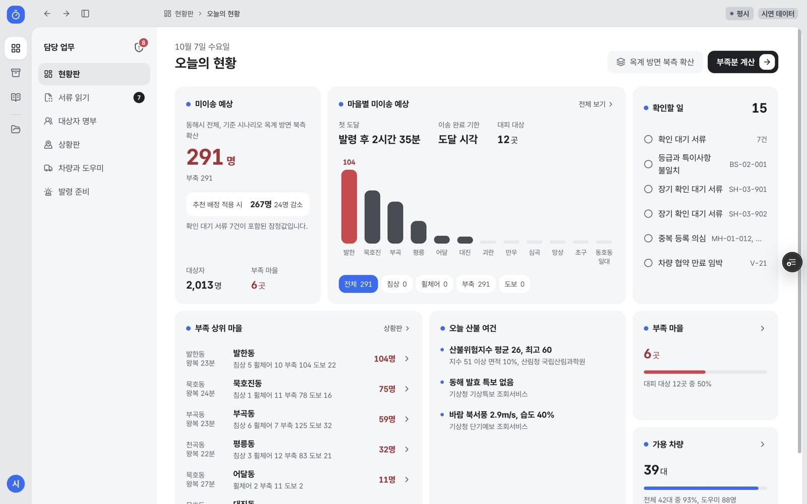
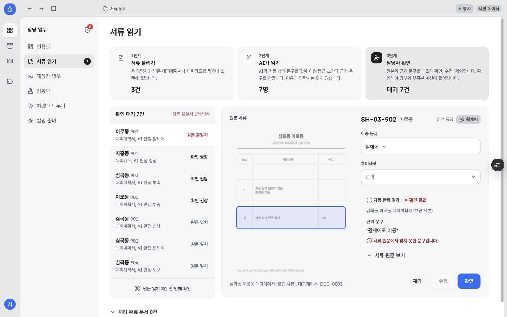
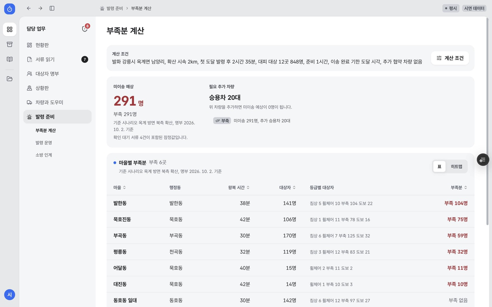
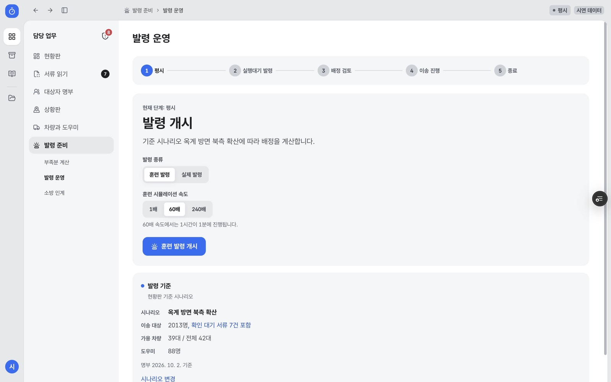
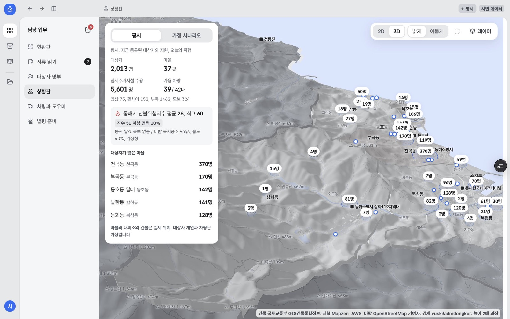
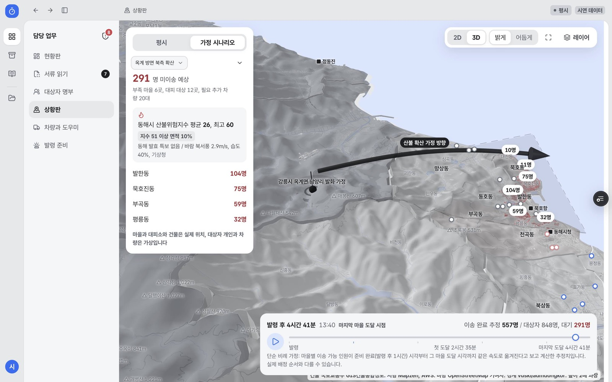
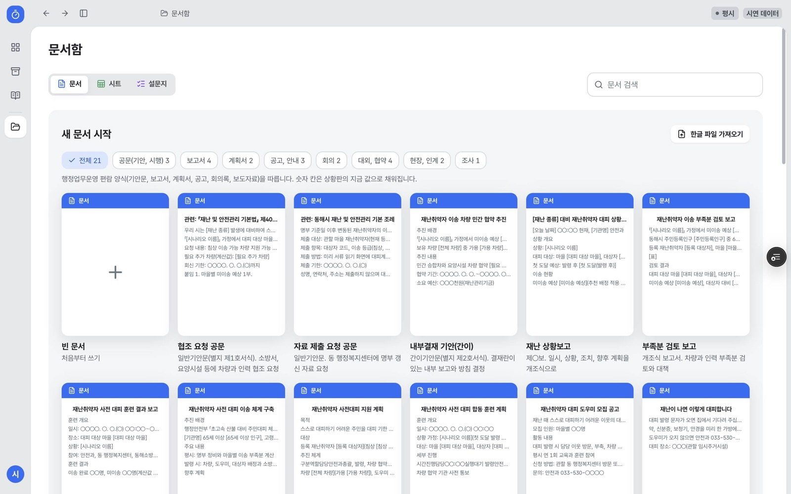
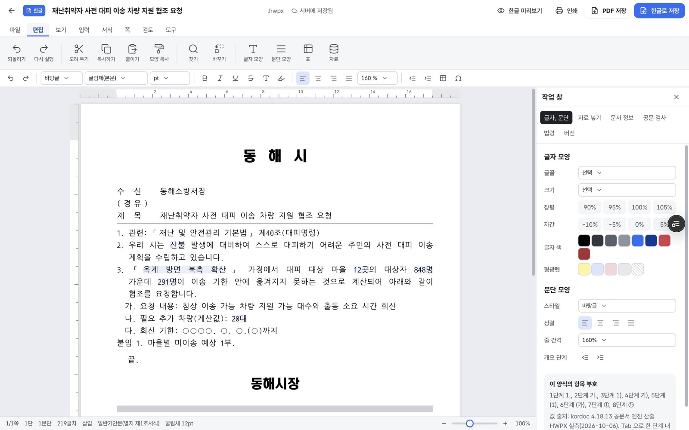

# 미리

**미리 계산하고, 미리 옮긴다.**

[](https://miri-indol.vercel.app)
[](./LICENSE)

> *산불이 마을에 닿기 전에 누워 계신 분, 휠체어를 타시는 분을 옮길 차가 몇 대 모자라는지 아무도 미리 계산하지 않는다. 그 숫자를 평소에 알고 싶어서 만들었다.*

재난취약자를 대피 기한 안에 옮길 차와 사람이 **몇 명분 부족한지 평소에 계산**하고, 대피 발령 때 **차량, 도우미, 대상자를 묶어 배정**하는 읍면동 재난 담당자용 웹 서비스다. 시범 지역은 강원특별자치도 동해시다.



**[지금 바로 써 보기 (miri-indol.vercel.app)](https://miri-indol.vercel.app)** | **[사례 소개 (miri-case.vercel.app)](https://miri-case.vercel.app)**

설치와 로그인 없이 담당자 화면이 바로 열린다.

> [!CAUTION]
> 시연용이다. 대상자 개인, 차량, 도우미, 서류 사진은 가상이고, 마을과 대피소, 건물, 인구, 장기요양 통계는 실제 공개 자료다. 부족분은 규칙으로 계산한 값이며 실제 대피 판단의 단일 근거로 쓰지 않는다. 동해시 담당자 사용 검증은 진행 예정이다.

---

## 목차

- [미리로 무엇을 할 수 있나요](#미리로-무엇을-할-수-있나요)
- [평소에 쓰는 화면](#평소에-쓰는-화면)
- [발령 때 쓰는 화면](#발령-때-쓰는-화면)
- [상황판](#상황판)
- [문서함](#문서함)
- [이런 업무에 쓰세요](#이런-업무에-쓰세요)
- [왜 필요한가](#왜-필요한가)
- [계산 규칙](#계산-규칙)
- [AI는 어디까지 쓰나](#ai는-어디까지-쓰나)
- [무엇이 실제이고 무엇이 가정인가 (정직 고지)](#무엇이-실제이고-무엇이-가정인가-정직-고지)
- [한계](#한계)
- [데이터 출처](#데이터-출처)
- [개인정보 설계](#개인정보-설계)
- [처음 써 보기](#처음-써-보기-처음이라면-여기부터)
- [다른 지역에서 쓰려면](#다른-지역에서-쓰려면)
- [검증 현황과 남은 일](#검증-현황과-남은-일)
- [기술 구성](#기술-구성)
- [개발자용](#개발자용)
- [만든 사람](#만든-사람)
- [참고한 공공 산출물과 라이선스](#참고한-공공-산출물과-라이선스)

---

## 미리로 무엇을 할 수 있나요

알림을 보내는 도구는 많다. 미리는 **알림을 받아도 혼자 움직일 수 없는 사람**을 정해진 시간 안에 옮길 수 있는지를 다룬다.

* **부족분 계산**: 산불이 마을에 닿는 시각 안에 옮기지 못하는 인원을 마을별 숫자로 보여 준다. 봄철 산불 조심 기간 전에 차량 협약을 몇 대 더 맺어야 하는지가 여기서 나온다.
* **도달 시각 역산**: 확산 가정에서 마을별 도달 시각을 구하고, 거기서 이송 완료 기한과 발령 기한을 거꾸로 계산한다.
* **추천 배정**: 기본 순서보다 미이송이 줄어드는 배정을 찾는다. 기본 시나리오에서 미이송 예상 291명이 267명으로 24명 줄어든다.
* **서류 읽기**: 종이 대피계획서와 대피카드 사진에서 이송 등급 초안과 근거 문구를 뽑는다. 근거 문구가 원문에 실제로 있는지 자동으로 대조하고, 담당자가 확인해야 명부에 들어간다.
* **상황판**: 동해시와 주변 시군의 실제 지형과 건물 196,111동 위에 마을별 대기 인원, 대피소, 산불 확산 가정을 겹쳐 본다.
* **발령과 배정표**: 훈련 또는 실제 발령을 내리면 차량, 도우미, 대상자를 묶은 배정이 도우미 휴대폰으로 간다. 기한 안에 못 옮긴 사람은 소방 인계 목록으로 넘어간다.
* **문서함**: 협조 공문, 상황보고, 훈련 계획 같은 서식 21종에 상황판 숫자가 자동으로 들어가고, 한글(HWPX) 파일로 저장된다.
* **개방 API**: 마을별 부족분과 대피소 수용 현황을 다른 기관이 조회할 수 있다.

---

## 평소에 쓰는 화면

재난은 드물고 준비는 매일이다. 미리는 **평시 화면이 기본**이다. 평소에 열지 않는 도구는 재난 때도 열리지 않는다고 보았다.

### 현황판 (`/console`)

아침에 한 번 여는 화면이다. "오늘 발령이 나면 몇 명을 못 옮기나"를 맨 위에 둔다.

* **미이송 예상**: 기준 시나리오에서 기한 안에 못 옮기는 인원과 추천 배정 적용 시 줄어드는 인원
* **마을별 미이송 예상**: 이송 등급(침상, 휠체어, 부축, 도보)별로 걸러 보는 막대
* **확인할 일**: 확인 대기 서류, 등급과 특이사항 불일치, 중복 등록 의심, 만료가 다가오는 차량 협약
* **오늘 산불 여건**: 산림청 산불위험지수, 기상청 특보와 바람(실시간)
* **가용 차량, 부족 마을**: 전체 대비 가용 대수와 부족 마을 수

### 서류 읽기 (`/console/intake`)



동 담당자가 받은 종이 대피계획서와 대피카드를 찍어 올리면 세 단계로 처리한다.

1. **서류 올리기**: 사진이나 스캔본을 올린다.
2. **AI가 읽기**: 거동 상태 문구를 찾아 이송 등급 초안과 근거 문구를 만든다. 이름과 연락처는 읽지 않는다.
3. **담당자 확인**: 원본과 근거 문구를 나란히 보고 확인, 수정, 제외한다. 근거 문구가 원문에 없으면 **원문 불일치**로 표시해 먼저 보게 한다.

확인을 거친 건만 명부와 부족분 계산에 들어간다. 원문과 일치하는 건은 한 번에 확인할 수 있다.

### 대상자 명부 (`/console/roster`)

목록, 지도, 서식 출력으로 본다. 화면에는 이름 대신 대상자 코드(예: `SH-03-902`)만 나온다.

### 차량과 도우미 (`/console/resources`)

차량 42대와 도우미 88명의 가용 상태, 대기 동, 민간 협약 만료일을 관리한다. 차량을 추가하거나 고치는 창은 화면 가운데에 뜬다.

### 부족분 계산 (`/console/shortage`)



계산 조건(발화 지점, 확산 속도, 준비 시간, 추가 협약 차량)을 바꾸면 마을별 부족분과 **필요 추가 차량**이 바로 다시 계산된다. "승용차 20대를 더 확보하면 미이송 0명"처럼 협약 규모를 숫자로 정할 수 있다. 표와 히트맵 두 가지로 본다.

---

## 발령 때 쓰는 화면

### 발령 운영 (`/console/dispatch`)



평시, 실행대기 발령, 배정 검토, 이송 진행, 종료의 다섯 단계로 진행한다.

* **훈련 발령과 실제 발령**을 구분한다. 훈련은 1배, 60배, 240배 속도로 시간을 돌려 볼 수 있다.
* 배정 검토 단계에서 담당자가 배정표를 보고 고친 뒤 보낸다.
* 이송 진행 중에는 차량별 출발, 탑승, 도착이 들어온다.

### 도우미 휴대폰 (`/h/demo`)


도우미는 앱을 설치하지 않는다. 배정이 오면 문자와 이 화면으로 알린다. 화면을 열면 **내 배정**(차량, 대상자 수, 대피소, 첫 출발 시각)이 보이고 수락 또는 불가로 응답한다. 이후 출발, 탑승, 도착을 단추 하나로 알린다. 본인 담당 대상자만 발령 기간에 보이고, 종료하면 지워진다.

### 소방 인계 (`/console/handover`)

기한 안에 옮기지 못할 것으로 계산된 대상자를 소방에 넘길 목록으로 정리한다.

---

## 상황판

상황판은 서비스의 중심 화면이 아니다. 중심은 명부, 부족분, 발령으로 이어지는 업무 흐름이고, 상황판은 그 숫자를 지도 위에서 보여 준다. 상황에 따라 보는 것이 달라진다.

| 상황 | 언제 | 보는 것 | 정하는 것 |
| --- | --- | --- | --- |
| 평시(기본) | 늘 | 마을별 대상자 수와 등급, 임시주거시설 수용, 가용 차량, 오늘 산불위험지수와 특보 | 오늘이 위험한 날인지, 대피소가 모자란 마을이 있는지 |
| 가정 시나리오 | 계획, 훈련, 시연 때 켠다 | 발화 가정 지점과 확산 방향, 도달 시각, 마을별 미이송 예상, 시간 축 재생 | 봄철 전 차량 협약 규모 |
| 발령 중 | 실제 또는 훈련 발령 때 자동 | 그 발령의 시나리오로 고정 | 다음 차량을 보낼 곳, 소방 인계 대상 |

**평시**



**가정 시나리오** (옥계 방면 북측 확산)



* **범위**: 동해시와 맞닿은 강릉시(옥계면 포함), 삼척시, 정선군, 태백시까지 읍면동 60곳
* **지형과 건물**: 실제 고도로 만든 읍면동 조각 위에 국토교통부 GIS건물통합정보 196,111동을 대장 높이 또는 층수로 세운다.
* **시간 축 재생**: 발령 후 시간이 흐르면서 마을별 이송 완료와 대기 인원이 어떻게 바뀌는지 본다.
* **가까이 보기**: 10km 안으로 다가가면 골목과 길 이름까지 다시 그린다.
* **2D 보기**: 저사양 컴퓨터에서는 2D 지도로 바꿀 수 있다.

### 재난 종류별 가정 시나리오

| 종류 | 근거 | 대상 마을 선정 |
| --- | --- | --- |
| 산불 | 행정안전부 「초고속 산불 대비 주민대피 체계 개선방안」(2025. 4. 16.) | 확산 띠 안 마을 |
| 지진해일 | 연합뉴스 2024. 1. 2.(노토반도 지진, 묵호 첫 도달 18:06, 최대 85cm) | 해안 거리, 고도 기준(가정) |
| 태풍 호우 침수 | 연합뉴스 2019. 10. 3.(태풍 미탁 동해 367.7mm) | 저지대, 하천 인접(가정) |
| 산사태 | 연합뉴스 2019. 10. 3.(삼척 오분동 비탈 붕괴) | 경사 기준(가정) |
| 대설 고립 | 연합뉴스 2014. 2. 10.(영동 폭설, 14개 마을 390여 가구 고립) | 산간 마을, 이동 시간 1.8배(가정) |

---

## 문서함



재난 담당자의 평소 업무 대부분은 공문이다. 문서함은 왼쪽 아이콘 줄 맨 아래에 있다.

### 서식 21종

공문(기안, 시행), 보고서, 계획서, 공고와 안내, 회의, 대외 협약, 현장 인계, 조사로 나뉜다. 행정업무운영 편람 양식(기안문, 보고서, 계획서, 공고, 회의록, 보도자료)을 따른다.

| 서식 예 | 쓰는 때 |
| --- | --- |
| 협조 요청 공문 | 소방서, 요양시설에 차량과 인력 지원 요청 |
| 자료 제출 요청 공문 | 동 행정복지센터에 명부 갱신 자료 요청 |
| 재난취약자 이송 차량 민간 협약 추진(내부결재) | 봄철 전 협약 규모 결정 |
| 재난 상황보고 | 발령 중 일시, 상황, 조치, 향후 계획 보고 |
| 부족분 검토 보고 | 차량과 인력 부족분 검토와 대책 |
| 사전 대피 훈련 계획, 훈련 결과 보고 | 훈련 전후 |
| 대피 도우미 모집 공고, 주민 안내문 | 도우미 모집, 주민 홍보 |

### 한글처럼 쓰고 한글로 저장



* **웹한글과 같은 배치**: 메뉴, 기능 상자, 서식 도구 상자, 눈금자, 상태 표시줄. 공무원에게 익숙한 자리에 같은 기능을 두었다.
* **양식이 파일과 같다**: 쪽 여백, 글꼴, 줄 간격, 항목 부호(1. 가. 1) 가))는 실제로 만든 한글 파일에서 잰 값으로 그린다. 화면에서 본 모양이 저장한 파일과 같다.
* **자료 넣기**: 미이송 예상, 필요 추가 차량 같은 숫자를 본문에 넣으면 문서를 열 때마다 지금 값으로 바뀐다. 이 문서에서만 다른 값을 쓰려면 그 자리에서 고치고, 상황판 값으로 되돌릴 수 있다.
* **계산 넣기**: 자료 A, 계산(비율, 나누기, 곱하기, 더하기, 빼기), 자료 B를 골라 "미이송 비율 35.4%" 같은 값을 만든다. 미이송 비율, 차량 가용률처럼 자주 쓰는 계산은 한 번에 넣는다.
* **공문 검사와 법령 확인**: 편람 표기 규칙을 검사하고, 「법령명」 제N조 인용이 실제로 있는지 법제처 자료로 확인한다.
* **내보내기**: 한글로 저장(HWPX), 한글 미리보기, 인쇄, PDF 저장. 저장 전에 파일 구조 검사를 통과한 것만 내려보낸다.
* **시트와 설문지**: 문서 외에 표 계산(시트)과 설문지도 만든다.

문서함 맨 위에는 **프로젝트 인수인계서**가 고정돼 있다. 이 저장소를 이어받는 사람이 처음 읽을 문서다.

---

## 이런 업무에 쓰세요

### 1. 봄철 산불 조심 기간 전, 차량 협약 규모 정하기
부족분 계산에서 "추가 협약 차량"을 늘려 가며 미이송이 0명이 되는 대수를 찾는다. 결과를 **재난취약자 이송 차량 민간 협약 추진** 내부결재 서식에 넣으면 숫자가 자동으로 채워진다.

### 2. 소방서와 요양시설에 지원 요청하기
**협조 요청 공문** 서식을 열면 시나리오 이름, 대피 대상 마을 수, 대상자 수, 미이송 예상, 필요 추가 차량이 이미 들어 있다. 수신처와 회신 기한만 채워 한글로 저장한다.

### 3. 동에서 올라온 종이 대피계획서 정리하기
서류 읽기에 사진을 올리고, 원문 불일치 건부터 확인한다. 확인한 대상자만 명부와 계산에 들어간다.

### 4. 사전 대피 훈련 계획과 결과 보고
발령 운영에서 훈련 발령을 60배 속도로 돌려 보고, 상황판 시간 축으로 마을별 이송 진행을 확인한다. **훈련 계획**, **훈련 결과 보고** 서식으로 정리한다.

### 5. 위험한 날 아침 점검
현황판의 오늘 산불 여건(산불위험지수, 특보, 바람)과 가용 차량을 보고, 확인할 일(만료 임박 협약, 확인 대기 서류)을 처리한다.

### 6. 실제 발령
발령 운영에서 실제 발령을 내리고, 배정표를 검토해 보낸다. 도우미 응답과 이송 진행을 보며, 기한 안에 못 옮길 대상자는 소방 인계로 넘긴다. 진행 중 **재난 상황보고** 서식으로 보고한다.

### 7. 다른 기관과 숫자 맞추기
개방 API(`/api/open`)로 마을별 부족분과 대피소 수용 현황을 공유한다. 같은 숫자를 보고 회의한다.

---

## 왜 필요한가

재난 알림 체계는 갖춰졌지만 이송 체계는 비어 있다. 재난문자와 안전디딤돌은 걸을 수 있는 사람의 자력 대피를 전제로 한다. 거동이 불편한 사람은 알림을 받아도 차와 사람이 도착해야 대피할 수 있다. 정해진 시간 안에 차와 사람이 충분한지 계산하는 도구가 없다.

행정안전부는 「초고속 산불 대비 주민대피 체계 개선방안」(2025. 4. 16.)에서 위험구역 5시간 전 대피와 재난취약자 8시간 전 대피 체계를 지자체에 제시했다. 8시간 전에 옮기려면 그보다 먼저 차가 몇 대 필요한지 알아야 한다.

| 근거 수치 | 값 | 시점과 출처 |
| --- | --- | --- |
| 영남 산불 대피 과정 사망 | 31명, 60대 이상 28명(90.3%) | 2025. 3. 중앙재난안전대책본부 |
| 스스로 준비할 수 없어 대피를 포기한 비율 | 57.7% | 2026. 9. 2. 국립재난안전연구원 |
| 복지시설 긴급 전원 | 52개 기관 1,458명 | 2025. 3. 보건복지부 |
| 울진 삼척 산불 대피 | 35개 마을 6,482명 | 2022. 3. 행정안전부 재난연보 |
| 동해시 주민등록인구와 65세 이상 | 85,445명 중 23,590명 | 2026년 9월, 행정안전부(KOSIS DT_1B04005N) |
| 동해시 재가 장기요양 수급자 추정 | 2,005명 | 2025년 급여이용수급자 2,668명에서 시설급여 663명을 뺌, 국민건강보험공단(KOSIS) |

동해시를 시범 지역으로 고른 이유: 2022년 강릉 옥계 산불이 동해시 망상동까지 번졌고, 65세 이상 비율이 27.6%(위 표 기준)다.

### 기존 서비스와 무엇이 다른가

| 구분 | 기존 서비스 | 하지 않는 일 |
| --- | --- | --- |
| 알림 | 재난문자, 안전디딤돌, 홍수알리미 | 거동 불편자 이송 |
| 종이 계획 | 산불 취약 특수보호시설 대피계획 가이드라인 | 재가 거주자 포함과 차량 부족 계산 |
| 사람 지정 | 제주 대피 도우미, 충남 안전 파트너 | 정해진 시간 안 이송 가능 여부 판단 |
| 자원 관리 | 재난관리자원 통합관리시스템(KRMS) | 취약자 개인별 차량 배정 |
| 해외 상용 | 일본 NEC 피난 행동 지원 서비스(2024. 2.) | 시간 제약 계산과 부족분 산정 |

사회보장정보시스템 등 내부 행정 시스템과의 기능 중복 여부는 담당자 인터뷰에서 확인할 예정이다.

---

## 계산 규칙

부족분은 대상자 수에서 기한 안 이송 가능 인원을 뺀 값이다.

```
이송 가능 인원 = 차량 수 x 왕복 가능 횟수
왕복 가능 횟수 = (이송 기한 - 준비 시간) / 왕복 시간
왕복 시간     = 집결지에서 임시주거시설까지 도로 주행 시간 x 2 + 탑승과 하차 시간(기본 20분)
부족분        = 대상자 수 - 이송 가능 인원
```

| 이송 등급 | 대상 | 필요 차량과 인력 |
| --- | --- | --- |
| 침상 | 누운 상태로만 이송 가능 | 구급차나 침상 승합차와 구급대원 |
| 휠체어 | 휠체어에 앉은 채로 이동 | 리프트 승합차와 도우미 2명 |
| 부축 | 부축을 받으면 승용차 탑승 가능 | 승용차와 도우미 1명 |
| 도보 | 안내만 받으면 스스로 이동 | 마을 버스나 승용차와 인솔 1명 |

* **배정 순서**: 이송 난도가 높은 침상부터 도보 순으로, 같은 등급 안에서는 도달 시각이 빠른 마을부터
* **도로 주행 시간**: OpenStreetMap 기반 OSRM으로 미리 계산
* **추천 배정**: 기본 순서보다 미이송이 줄어드는 배정을 규칙 기반 탐색으로 찾는다. 기본 시나리오(옥계 방면 북측 확산)에서 291명이 267명이 된다.
* **장기요양 등급 대응**(1등급 침상, 2등급 휠체어, 3와 4등급 부축, 5등급과 인지지원등급 도보)은 팀 가정이다. 현장 검증 전이다.

계산 코드는 `client/src/lib/shortageCalc.js`, 시험은 `client/tests/logic.test.mjs`(9개)다.

---

## AI는 어디까지 쓰나

**AI는 계산하지 않는다.** 부족분과 배정은 위 규칙으로 계산한다. AI는 사람이 하던 반복 업무 가운데 결과를 원문과 대조할 수 있는 단계에만 쓴다.

| 단계 | AI가 하는 일 | 사람이 하는 확인 |
| --- | --- | --- |
| 서류 읽기 | 거동 상태 문구에서 이송 등급 초안과 근거 문구를 뽑음(Gemini 2.5 Flash) | 근거 문구가 원문에 있는지 자동 대조 뒤 담당자가 확인, 수정, 제외 |
| 법령 인용 확인 | 「법령명」 제N조가 실제로 있는지 법제처 자료로 확인 | 없는 조문은 표시만 하고 고치지 않음 |

AI에는 이름과 연락처를 보내지 않는다. 서류에서 보내는 값은 거동 상태 문구뿐이다.

---

## 무엇이 실제이고 무엇이 가정인가 (정직 고지)

같은 화면 안에 실제 공개 자료와 가상 자료, 팀 가정이 섞여 있다. 화면 오른쪽 위 **시연 데이터** 표시가 이를 알린다.

| 구분 | 항목 |
| --- | --- |
| **실제 공개 자료** | 마을 집결지(마을회관, 경로당 138곳), 임시주거시설 27곳, 건물 196,111동, 지형, 행정동 경계, 인구와 고령 인구, 장기요양 수급자 통계, 장기요양기관 정원, 도로 주행 시간 |
| **실시간 자료** | 산불위험지수(산림청), 기상특보와 단기예보(기상청) |
| **가상 자료** | 대상자 개인(2,013명), 차량 42대, 도우미 88명, 서류 사진 |
| **팀 가정** | 장기요양 등급과 이송 등급 대응, 탑승과 하차 20분, 준비 시간 1시간, 산불 외 재난의 대상 마을 선정 기준, 상황판 시간 축의 단순 비례 이송 진행 |

상황판에서 원 중심 550m 안 건물을 부족 단계 색으로 칠하는 것은 마을의 위치를 보여 주기 위한 표시다. 대상자의 실제 거주 위치를 뜻하지 않는다.

---

## 한계

* **부족분은 추정치다.** 도로 통제, 연기, 차량 고장, 대상자의 거부는 반영하지 않는다. 절대값보다 마을 간 비교와 협약 규모 판단에 쓴다.
* **확산 시나리오는 가정이다.** 실제 산불 확산 모델을 돌리지 않는다. 옥계 산불 기록을 바탕으로 한 방향과 속도 가정이다.
* **도로 진입 불가 구간**(좁은 길, 비포장)은 아직 반영하지 않는다.
* **실제 명부를 다루지 않는다.** 실제 운영에는 개인정보 처리 근거 확인과 보안 절차가 먼저 필요하다.
* **행정망 설치는 검토 전이다.** 지금은 공용 클라우드(Vercel)에 올라가 있다.
* **3D 상황판은 무겁다.** 저사양 컴퓨터와 휴대폰에서는 2D 보기를 쓴다.
* **한글 파일은 구조 검사를 통과했지만** 한컴 한글 프로그램에서 직접 연 확인은 진행 예정이다.
* **실제 담당자 사용 검증이 아직 없다.** 인터뷰와 사용성 평가는 2026. 10. 12.~10. 23. 진행 예정이다.

---

## 데이터 출처

| 자료 | 기관 | 기준 시점 | 쓰는 곳 |
| --- | --- | --- | --- |
| 행정동별 주민등록인구, 65세와 75세와 85세 이상 | 행정안전부(KOSIS DT_1B04005N) | 2026년 9월 | 고령화율, 대상자 배분 |
| 장기요양 등급 판정과 급여이용수급자 | 국민건강보험공단(KOSIS DT_35006_N007, N030) | 2025년 | 재가 수급자 추정 |
| 장기요양기관 정원과 현원 | 국민건강보험공단 장기요양기관 검색 | 2026. 10. 6. | 상황판 시설 |
| 이재민 임시주거시설 27곳 | 행정안전부 국민재난안전포털 | 2026. 10. 6. 조회 | 대피소 배정과 수용 |
| 마을회관과 경로당 138곳 | 동해시(공공데이터포털 15114136) | 2025. 11. 4. | 마을 집결지 |
| 건축물대장 법정동 집계 | 국토교통부 건축HUB | 2026. 10. | 법정동 대상자 배분 |
| 건물 윤곽, 높이, 층수, 용도 196,111동 | 국토교통부 GIS건물통합정보(브이월드) | 2026. 9. 9. | 3D 건물 |
| 행정동 경계 | 통계청 기반 vuski/admdongkor | 2023. 7. 1. | 지형 조각, 2D 경계 |
| 지형 고도 | Mapzen, AWS Terrain Tiles | 2026. 10. 6. 수집 | 3D 지형 |
| 도로, 물길, 지명, 산봉우리 | OpenStreetMap 기여자(OpenFreeMap) | 2026. 10. 7. 수집 | 바탕 지도와 이름표 |
| 도로 주행 시간 | OSRM 공개 서버(OpenStreetMap) | 빌드 때 계산 | 왕복 시간 |
| 산불위험지수 | 산림청 국립산림과학원 | 실시간 | 오늘 산불 여건 |
| 기상특보, 단기예보 | 기상청 | 실시간 | 특보, 바람 |
| 옥계 산불 확산 기록 | 연합뉴스 | 2022. 3. 5. | 기본 시나리오 발화 지점과 방향 |
| 법령 원문 | 법제처 국가법령정보(Open API) | 2026. 10. 6. 수집 | 법령 인용 확인, 핵심 법령 11개 1,026조문 |

---

## 개인정보 설계

* **명부 원본은 지자체 서버에 둔다.** 클라우드에는 이름을 뺀 이송 등급과 마을 코드만 둔다.
* **화면에는 대상자 코드만** 보인다.
* **도우미 휴대폰**에는 본인 담당 대상자만 발령 기간에 보이고, 종료 시 지운다.
* **서류 읽기는 이름과 연락처를 읽지 않는다.** AI에 보내는 값은 거동 상태 문구뿐이다.
* **근거 조항(기획서 기준)**: 「재난 및 안전관리 기본법」 제31조의2와 제40조(안전취약계층 대피 지원), 「노인장기요양보험법」 제53조의2와 「재난 및 안전관리 기본법」 제74조의2(장기요양 정보 수급), 「재난 및 안전관리 기본법」 제74조의3과 「개인정보 보호법」 제18조제2항(재난 시 정보 제공). 실제 적용 가능 여부는 담당 부서 확인이 필요하다.

---

## 처음 써 보기 (처음이라면 여기부터)

설치와 로그인 없이 5분이면 흐름 전체를 볼 수 있다.

**1단계. 현황판 보기**
1. [miri-indol.vercel.app](https://miri-indol.vercel.app)을 연다. 현황판이 바로 열린다.
2. 미이송 예상 숫자와 "추천 배정 적용 시" 줄어드는 인원을 본다.
3. 마을별 막대 아래 **휠체어**, **부축** 같은 칩을 눌러 등급별로 걸러 본다.

**2단계. 상황판에서 가정 시나리오 보기**
1. 왼쪽 메뉴에서 **상황판**을 누른다.
2. 왼쪽 위 **가정 시나리오**를 누른다. 산불 확산 가정 방향과 마을별 미이송 인원이 나타난다.
3. 아래 시간 축의 재생 단추를 눌러 발령 후 시간 흐름을 본다.

**3단계. 부족분 계산하기**
1. **발령 준비 > 부족분 계산**으로 간다.
2. **계산 조건**을 눌러 추가 협약 차량을 늘려 보고, 미이송이 줄어드는 것을 확인한다.

**4단계. 서류 확인하기**
1. **서류 읽기**로 간다.
2. 빨간 **원문 불일치** 건을 눌러 원본 서류와 근거 문구를 비교한다.
3. 이송 등급을 고치거나 **제외**를 누른다.

**5단계. 협조 공문 만들어 한글로 저장하기**
1. 왼쪽 아이콘 줄 맨 아래 **문서함**을 누른다.
2. **협조 요청 공문**을 고른다. 미이송 예상, 필요 추가 차량이 본문에 이미 들어 있다.
3. 오른쪽 작업 창의 **자료 넣기**에서 숫자 줄을 눌러 이 문서의 값만 고쳐 본다.
4. 오른쪽 위 **한글로 저장**을 누른다. HWPX 파일이 내려받아진다.

**6단계. 훈련 발령과 도우미 화면**
1. **발령 준비 > 발령 운영**에서 훈련 발령, 60배를 고르고 **훈련 발령 개시**를 누른다.
2. 휴대폰으로 [miri-indol.vercel.app/h/demo](https://miri-indol.vercel.app/h/demo)를 열고 **시연 발령 시작**을 눌러 도우미가 받는 배정을 본다.

---

## 다른 지역에서 쓰려면

미리는 동해시 자료로 시연하지만, 공개 자료만으로 다른 시군에 옮길 수 있게 만들었다.

1. **시군 코드 바꾸기**: 자료 굽기 스크립트의 시군 코드(동해시 51170)와 범위를 바꾼다.
2. **공개 자료 다시 굽기**: 인구, 장기요양, 임시주거시설, 마을회관과 경로당, 도로 주행 시간을 다시 받는다(`client/scripts/build-donghae-data.mjs`).
3. **지형과 건물 다시 굽기**: `client/scripts/build-village-terrain.mjs`, `tools/bake-basemap`, `tools/bake-buildings`(브이월드 GIS건물통합정보 시도 SHP 필요)
4. **시나리오 정하기**: 그 지역 산불 기록이나 위험지도에 맞춰 발화 지점과 확산 방향을 정한다.
5. **명부 연결**: 지자체 서버의 명부에서 대상자 코드, 이송 등급, 마을 코드만 넘기는 연결을 만든다(계약은 `docs/API_CONTRACT.md`).

---

## 검증 현황과 남은 일

| 항목 | 상태 |
| --- | --- |
| 부족분 계산 규칙 시험 | 9개 통과 |
| 서류 판독 원문 대조 | 시연 서류 4종으로 확인 |
| 한글 파일 구조 검사 | 통과(validateHwpx, kordoc 조판) |
| 한컴 한글 프로그램 직접 열람 | 진행 예정 |
| 동해시 재난부서 담당자 인터뷰 | 진행 예정(2026. 10. 12.~10. 23.) |
| 담당자 사용성 평가 | 진행 예정 |
| 기관 협조 요청 | 진행 예정 |
| 이송 등급 대응 가정 현장 검증 | 진행 예정 |
| 기존 행정 시스템과의 중복 확인 | 진행 예정 |
| 도로 진입 불가 구간 반영 | 진행 예정 |
| 3D 상황판 저사양 기기 성능 | 진행 예정 |
| 실제 침수흔적도, 산사태 위험지도, 해일 대피지구 반영 | 진행 예정 |
| 법령 사전 화면 | 서버 기능 완료, 화면 진행 예정 |

---

## 기술 구성

| 영역 | 쓴 것 |
| --- | --- |
| 화면 | React 18, Vite, Tailwind CSS, KRDS(디지털 정부 디자인 시스템) 색과 서체(Pretendard GOV) |
| 3D 상황판 | three.js, Web Worker, Delaunator, Constrainautor, earcut |
| 2D 지도 | MapLibre GL JS |
| 한글 문서 | kordoc(HWPX 생성과 조판), 서버에서 서식 덧입힘과 구조 검사 |
| 법령 | korean-law-mcp, 법제처 Open API |
| AI | Gemini 2.5 Flash(서류 읽기만) |
| 서버 | Vercel 서버리스 함수, Upstash Redis(문서함 저장) |

계산은 서버 없이 화면에서 한다. 지도와 지형, 건물 자료는 미리 구워 정적 파일로 둔다.

---

## 개발자용

### 설치 및 실행

```bash
git clone https://github.com/hyunho2378/miri.git
cd miri/client
npm install
npm run dev                  # http://localhost:5173
node tests/logic.test.mjs    # 계산 규칙 시험 9개
npm run build
```

`/api` 요청은 개발 중에 배포 서버로 넘어간다(`VITE_API_PROXY`로 바꿀 수 있다). 가상 데이터로 동작하므로 키 없이도 화면 전체를 볼 수 있다.

### 환경 변수

Vercel 서버에만 둔다. 화면 코드에 노출하지 않는다.

| 변수 | 쓰는 곳 | 없을 때 |
| --- | --- | --- |
| `GEMINI_API_KEY` | 새로 올린 서류 판독(`api/intake.js`) | 판독 서버 미연결로 안내. 미리 들어 있는 시연 서류로 확인 흐름은 볼 수 있다 |
| `DATA_GO_KR_KEY` | 산림청 산불위험지수, 기상청 특보와 예보(`api/opendata.js`) | 오늘 산불 여건에 불러오지 못한 이유를 표시 |
| `LAW_OC` | 법령 인용 확인과 법령 사전(`api/law.js`). 법제처 Open API 키 | 내장 핵심 법령과 공개 서버 기본값으로 동작 |
| `UPSTASH_REDIS_REST_URL`, `UPSTASH_REDIS_REST_TOKEN` (또는 `KV_REST_API_URL`, `KV_REST_API_TOKEN`) | 문서함 저장(`api/workspace.js`) | 브라우저 저장소만 사용 |
| `MIRI_WS_PREFIX` | 문서함 시험용 키 접두어 | 기본값 `miri:ws`. 배포 환경에서는 설정하지 않는다 |

### 배포

Vercel 프로젝트 두 개로 나눈다. 서비스는 `client/`, 사례 소개는 `case/`를 루트로 둔다.

### 개방 API

| 요청 | 돌려주는 것 |
| --- | --- |
| `GET /api/open?kind=summary` | 동해시 기준 수치(인구, 장기요양, 임시주거시설)와 출처 |
| `GET /api/open?kind=villages` | 마을 37곳의 집결지, 추정 대상자 수, 지정 대피소, 왕복 시간 |
| `GET /api/open?kind=shelters` | 이재민 임시주거시설 27곳 |
| `GET /api/open?kind=facilities` | 노인요양시설, 주야간보호, 동 행정복지센터 |
| `GET /api/open?kind=scenarios` | 확산 시나리오 목록 |
| `GET /api/open?kind=scenario&id=S-1` | 시나리오별 마을 부족분, 대피소 배정, 필요 추가 차량 |

### 저장소 구조

```text
client/            서비스
  api/             Vercel 서버리스(서류 판독, 공공 API 중계, 법령, 한글 문서, 문서함, 개방 API)
  src/pages/       담당자 화면(console), 문서함(workspace), 도우미 화면(helper), 공개 화면(public)
  src/lib/         부족분 계산, 배정, 이상 탐지(순수 함수), 인수인계서 원본
  src/three/       3D 상황판(지형 조각, 건물, 바탕 지도, 지명)
  src/mock/        공개 자료로 만든 정적 데이터와 가상 데이터
  scripts/         공개 자료, 지형, 한글 양식 치수, 핵심 법령을 굽는 스크립트
  public/terrain/  지형, 바탕 지도, 건물 파일
  tests/           계산 규칙 시험
case/              사례 소개 사이트
tools/             3D 바탕 지도와 건물 굽는 스크립트
docs/              PRD, 정보 구조, 디자인 기준, 화면 경로, API 계약, 원문 인용
server/            백엔드 자리(계약은 docs/API_CONTRACT.md)
```

### 자료 굽기

| 결과 파일 | 스크립트 |
| --- | --- |
| 동해시 공개 자료(인구, 장기요양, 대피소, 집결지, 왕복 시간) | `client/scripts/build-donghae-data.mjs` |
| 마을 지형 | `client/scripts/build-village-terrain.mjs` |
| 바탕 지도와 지명 | `tools/bake-basemap/bake.js` |
| 건물 196,111동 | `tools/bake-buildings/extract.cjs` |
| 한글 양식 치수(`hwpMetrics.json`) | `client/scripts/bake-hwp-metrics.mjs` |
| 핵심 법령 11개 1,026조문(`public/law/core.json`) | `client/scripts/bake-law-core.mjs` |

### 처음 이어받는다면

1. 앱 문서함 맨 위 **프로젝트 인수인계서**(원본 `client/src/lib/handoverDoc.js`)를 읽는다.
2. 디자인 규칙은 `docs/DESIGN.md`, 화면 경로는 `docs/ROUTES.md`, 자주 틀리는 곳은 `docs/PITFALLS.md`에 있다.
3. 작업 단위마다 인수인계서의 판 번호를 올리고 변경 이력에 한 줄을 남긴다.

---

## 만든 사람

**한림대학교 서비스디자인 2026-2 Team 오아시스**
주현호, 허준희, 김서환, 김채린, 김민준

2026 AI·디지털 사회문제 해결 챌린지 출품: 주현호, 송준하

문의와 제안은 저장소 이슈로 남겨 주세요.

---

## 참고한 공공 산출물과 라이선스

### 참고한 공공 산출물

공공 개발산출물 저장소(gitlab.aigov.go.kr)에 공개된 다음 작업에서 방법을 배웠다.

* **kordoc, korean-law-mcp, archhub-mcp** (서울특별시 광진구 류승인): 한글 문서 생성과 조판, 법령 조회와 인용 검증, 건축물대장. MIT
* **표준주소실록 gjdong** (같은 작성자)의 제설 상황실: 건물 자료를 국토교통부 GIS건물통합정보로 쓰는 방법, README 구성
* **STAY UP 현장 상황판** (완주소방서 김무영): 검증 상태를 맨 위에 밝히는 방식, 판정 표시에 색과 모양을 같이 쓰는 방식. Apache-2.0

### 라이선스

* 코드: [MIT](./LICENSE)
* 자료는 각 출처의 이용 조건을 따른다.
  * 국토교통부 GIS건물통합정보, KOSIS, 공공데이터포털: 공공누리 출처표시
  * OpenStreetMap: ODbL
  * vuski/admdongkor: 저장소 LICENSE-DATA
  * Mapzen과 AWS Terrain Tiles: 출처 표시
